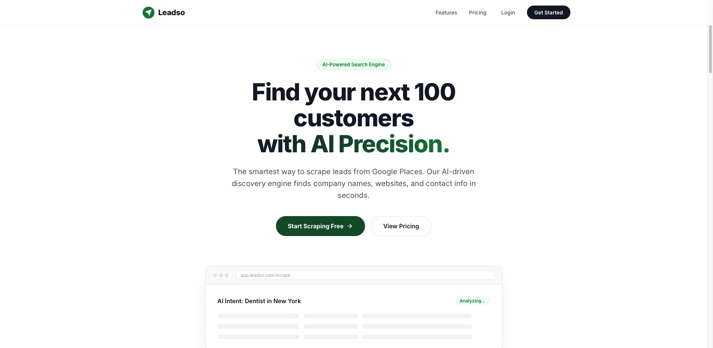

# Leadso - AI-Powered B2B Lead Generation



Leadso is the smartest way to scrape leads from Google Places. Our AI-driven discovery engine finds company names, websites, and contact info in seconds. Built for high-performance sales teams and marketers.

## 🚀 Key Features

- **AI-Powered Discovery**: Leverage advanced scraping via Apify's Google Places crawler to find highly relevant leads.
- **Dynamic Plan Limits**: Supports tiered lead extraction based on user subscription (Free, Basic, Growth, Scale).
- **Live Progress Tracking**: Watch your leads being extracted in real-time with a sleek dashboard visualization.
- **Executive CSV Exports**: Instantly download your leads in a clean, professional CSV format.
- **Smart Demo Mode**: Explore the platform's potential with simulated scraping even without an API key.
- **Responsive Dashboard**: Fully optimized for Desktop, Tablet, and Mobile
- **Integrated Payments**: Ready for SSLCommerz payment gateway.

## 🛠️ Tech Stack

- **Framework**: [Next.js 16 (App Router)](https://nextjs.org/)
- **Database & Auth**: [Supabase](https://supabase.com/)
- **Scraper Engine**: [Apify](https://apify.com/)
- **Styling**: Vanilla CSS Modules
- **Icons**: [Lucide React](https://lucide.dev/)

## 🏁 Getting Started

### 1. Clone the repository
```bash
git clone https://github.com/rayhanmirja/leadso-lead-generation.git
cd leadso-lead-generation
```

### 2. Install dependencies
```bash
npm install
```

### 3. Set up environment variables
Create a `.env` file in the root and add your keys:
```env
NEXT_PUBLIC_SUPABASE_URL=your_supabase_url
NEXT_PUBLIC_SUPABASE_ANON_KEY=your_supabase_anon_key
SERVICE_ROLE=your_supabase_service_role
APIFY_API_KEY=your_apify_key
APIFY_ACTOR_ID=compass/crawler-google-places
NEXT_PUBLIC_APP_URL=https://leadso-lead-generation.netlify.app
```

### 4. Database Setup
Run the following SQL in your Supabase SQL Editor to create the necessary tables:

```sql
-- Create the jobs table for persistent scrape history
CREATE TABLE jobs (
  id UUID DEFAULT gen_random_uuid() PRIMARY KEY,
  user_id UUID REFERENCES auth.users(id) ON DELETE CASCADE NOT NULL,
  job_id TEXT NOT NULL,
  query TEXT NOT NULL,
  leads_count INTEGER DEFAULT 0,
  status TEXT DEFAULT 'Completed',
  date TEXT NOT NULL,
  data JSONB DEFAULT '[]'::jsonb,
  created_at TIMESTAMP WITH TIME ZONE DEFAULT timezone('utc'::text, now()) NOT NULL
);

-- Enable RLS
ALTER TABLE jobs ENABLE ROW LEVEL SECURITY;

-- Create policies for secure access
CREATE POLICY "Users can view their own jobs" ON jobs FOR SELECT USING (auth.uid() = user_id);
CREATE POLICY "Users can insert their own jobs" ON jobs FOR INSERT WITH CHECK (auth.uid() = user_id);
```

### 5. Run the development server
```bash
npm run dev
```

Open [http://localhost:3000](http://localhost:3000) with your browser to see the result.

## 🎨 Design Philosophy

Leadso follows a "Premium Executive" aesthetic, utilizing:
- **HSL-tailored colors** for a cohesive brand identity.
- **Glassmorphism** and subtle micro-animations.
- **Modern Typography** (Outfit and Inter).
- **Pixel-perfect alignment** enforced by a global master-container system.

---

## Contact
- Website — [rayhanmirja.com](https://rayhanmirja.com)
- GitHub — [@rayhanmirja](https://github.com/rayhanmirja)
- LinkedIn — [rayhanmirja](https://linkedin.com/in/rayhanmirja)

## License
© Rayhan Mirja. All rights reserved.
The code in this repository is shared for reference and inspiration.